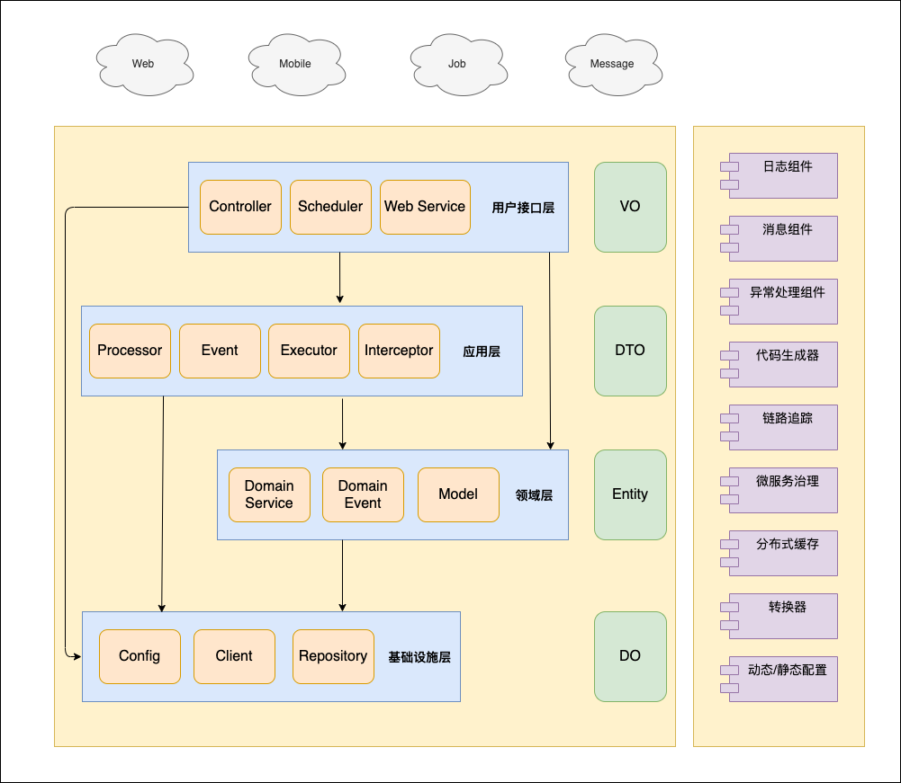

# 背景

## 目的

助力初创企业系统逐步微服务化。为了协作更顺畅，统一代码结构风格。尝试整理一套适合初创企业的应用架构。

## 简介

该项目为模板工程。依托于DDD 开源框架COLA 4.0应用架构。技术栈基于spring-cloud-alibaba、SpringBoot、Mybatis-plus、Feign、Nacos、RocketMq等。

# 设计

## 分层设计图

## 分层说明

> 应用系统在处理复杂的业务逻辑时，应该合理分层。而不是一锅粥的塞到Service实现类中。每一次处理各层应该处理的逻辑。

- demo-feign-api 处于适配层。由于公司内部服务调用使用Feign，所以在最上层增加一层feign-api方便调用方依赖。（使用Dubbo、gRPC等同理，如无需提供feign接口的可以不用该层。）
- demo-webapi 同处于适配层。提供Controller接口、scheduler（定时任务）等。
- demo-app 处于应用层。主要负责处理上层接口的业务逻辑。包含Processor、Executor、Event（MQ消息、本地消息等）、Interceptor(拦截器、切面)等。
- demo-domain 处于领域层。抽离出业务域中领域模块。包含Domain Service、Domain Event、实体等
- demo-infrastructure 处于基础设施层。其中包含数据仓库（Repository）、二方库（Client）、三方库等。
- start 是单独的启动配置类层。包含Main方法启动类和其他配置类（如Nacos等）。

# 集成功能

- mybatis-plus
- mybatis-plus-generator 代码生成器。(CodeGenerator.java)
- Redis
- RocketMq（Consumer：AliRocketMqBaseConsumer.java；Producer：AliRocketMqProducer.java）
- Nacos 服务治理；静态/动态配置管理。
- web-api通用异常、日志处理。(CommonExecutor.java)
- feign-api 服务调用。（open-feign，默认配置使用okhttp）
- OKHTTP 3接入。
- TraceId 接入。
- Swagger 2.0接入。
- 基于cglib的高性能bean copy工具类，支持bean和list copy。
- 提供Nacos动态k-v配置工具类。
- 序列化工具升级至fastjson2
- 增加微服务优雅下线功能
- Feign Trace Id 链路ID传递。（FeignApiInterceptor.java）

# 使用说明

1. 本项目Clone到本地。
2. 在根目录执行 mvn install -DskipTests。
3. 在根目录执行 mvn archetype:create-from-project。
4. 切换到target\generated-sources\archetype 目录下执行mvn install。
5. 在目标目录执行 mvn archetype:generate -DarchetypeCatalog=local。
6. 选择对应的模板编号。默认1。
7. 按提示输入相关新项目参数即可。

